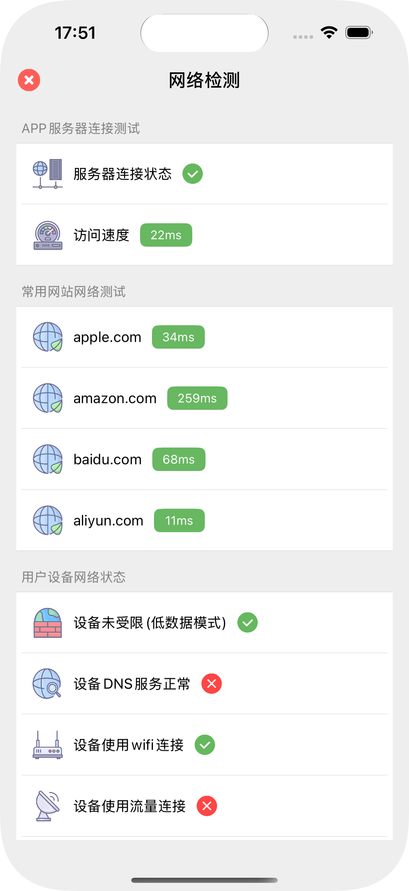

# DDNetCheck

A network status diagnostic tool for iOS, compatible with [DDKitSwift](https://github.com/DamonHu/DDKitSwift).

## Project Preview



## Features

When making network requests, failures may occur due to device issues or website/server outages. This tool helps diagnose problems from multiple perspectives, including device network status, website accessibility and latency, Apple site connectivity, etc., to determine whether the issue lies with the user's device or the server.

### Device Network Status Check

- Detects network type (Wi-Fi / Cellular)
- IPv4 / IPv6 support
- DNS resolution issues
- Proxy / VPN configuration
- Low Data Mode detection

### Website Diagnostics

- Simulates HTTP requests to the specified website
- Performs ping tests to evaluate network speed

### Reference Site Tests

- Simulates requests to well-known sites like `apple.com`, `baidu.com`, and `aliyun.com`  
- Helps verify whether the device can access public websites normally

## Usage

### CocoaPods

```
pod 'DDNetCheck'
```

### Start Test

```swift
let tool = DDNetCheck()
tool.showVC(url: "https://www.yechan.cn")
```

### Close Test View

```swift
tool.hideVC()
```

## Advanced Usage

If you want to manually control the test view, you can use `DDNetCheckVC`:

```swift
let vc = DDNetCheckVC(url: "https://www.yechan.cn")
vc.modalPresentationStyle = .fullScreen
self.present(vc, animated: true)
```